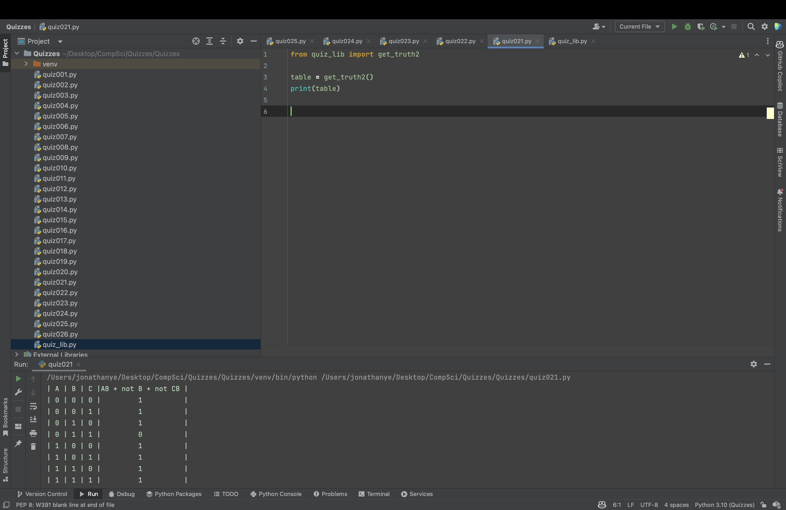
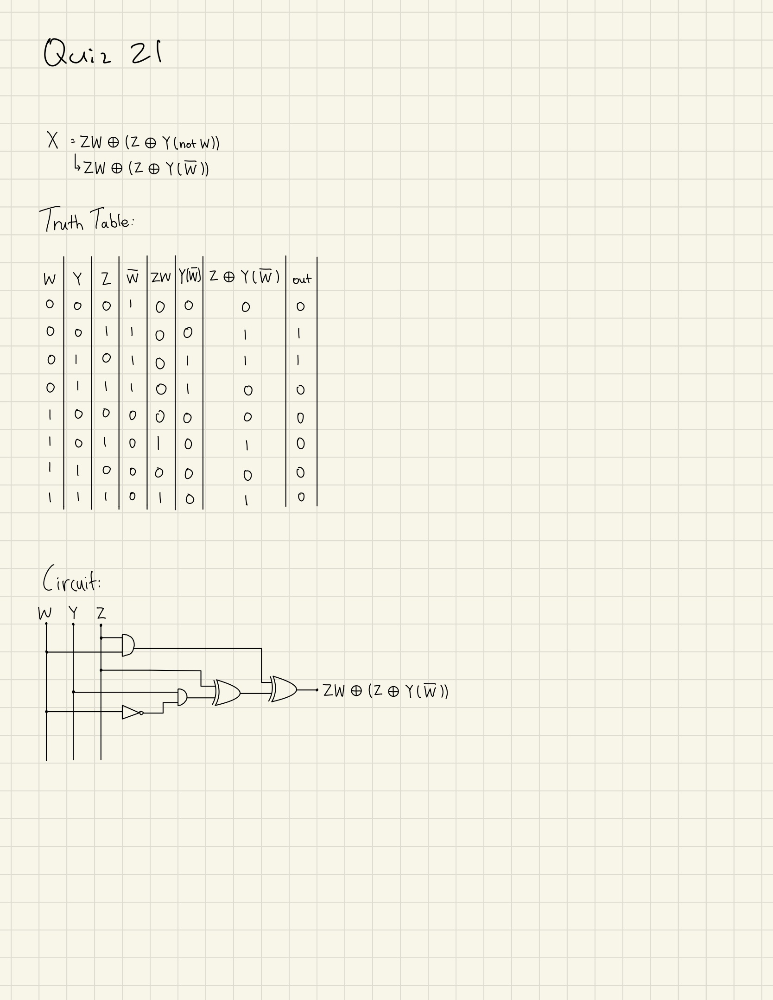

# Quiz 021
Using the function that produces the table of Truth for 3 inputs, add a column for the boolean equation AB+(not B)+(not CB)


```.py
def get_truth2():
    A = False
    B = False
    C = True

    print('| A | B | C |AB + not B + not CB |')
    for i in range(8):
        C = not C
        if i == 2 or i == 4 or i == 6:
            B = not B
        if i == 4:
            A = not A
        sol = int(A and B) or int(not B) or int(not (C and B))
        print(f'| {int(A)} | {int(B)} | {int(C)} | {str(sol).center(18)} |')
```




## Truth table and curcuit




