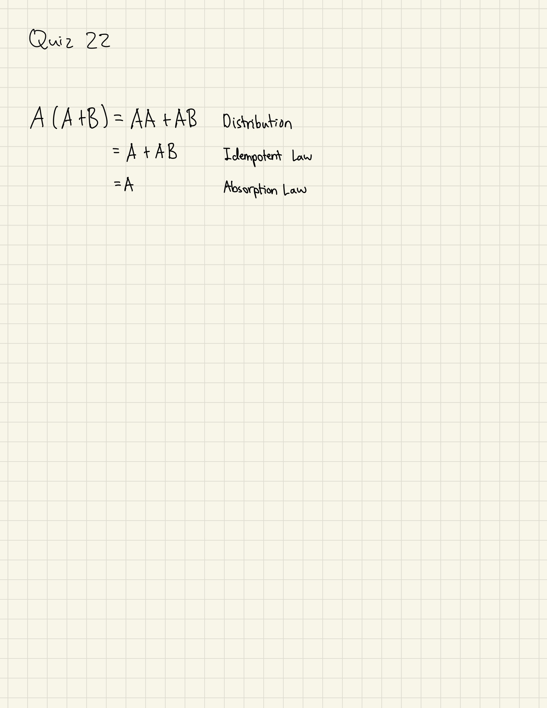

# Quiz 022
Create a program that produces n random values from the equation below, where m and s are the other inputs of the function 

```.py
import random
random.seed(1234)

def produce(n:int, m:int, s:int):
    print(f'|         x         |         y(x)        |')
    for i in range(n):
        x = random.randint(0,100)
        y = x ** (1/2 * (m/s) ** 2)
        rounded_y = round(y, 2)
        print(f'|     {str(x).center(10)}    |      {str(rounded_y).center(10)}     |')

sample = produce(n=5, m=3, s=2)
print(sample)
```


## Proof that: A (A + B) = A


