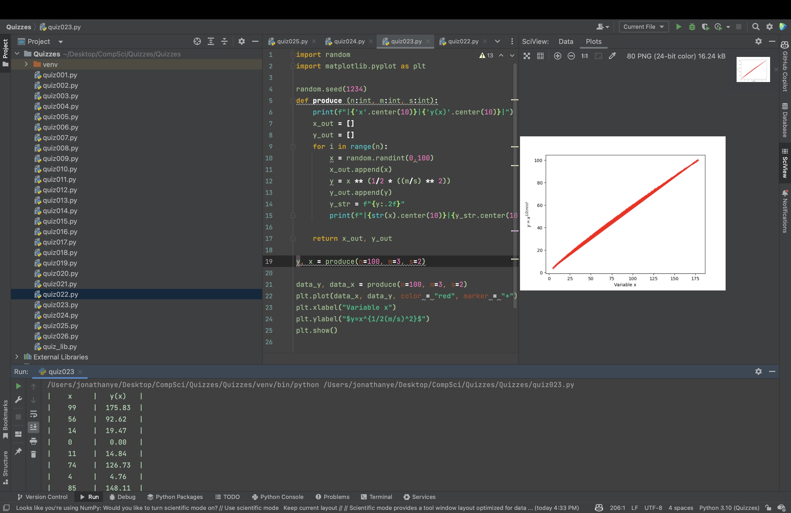
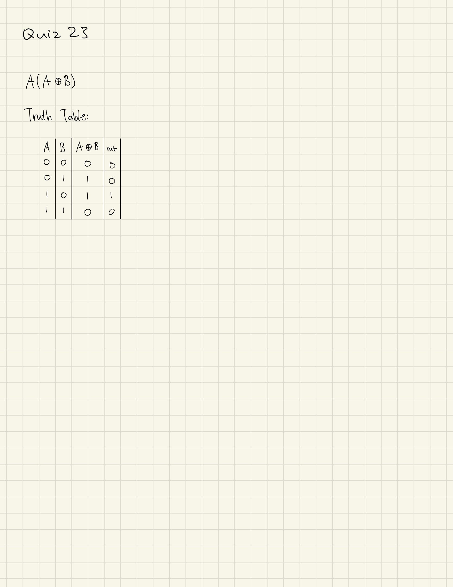

# Quiz 023
Create a function that produces the graph for the function in Quiz 022


```.py
import random
import matplotlib.pyplot as plt

random.seed(1234)
def produce (n:int, m:int, s:int):
    print(f"|{'x'.center(10)}|{'y(x)'.center(10)}|")
    x_out = []
    y_out = []
    for i in range(n):
        x = random.randint(0,100)
        x_out.append(x)
        y = x ** (1/2 * ((m/s) ** 2))
        y_out.append(y)
        y_str = f"{y:.2f}"
        print(f"|{str(x).center(10)}|{y_str.center(10)}|")

    return x_out, y_out

y, x = produce(n=100, m=3, s=2)

data_y, data_x = produce(n=100, m=3, s=2)
plt.plot(data_x, data_y, color = "red", marker = "+")
plt.xlabel("Variable x")
plt.ylabel("$y=x^{1/2(m/s)^2}$")
plt.show()
```



## Truth Table




