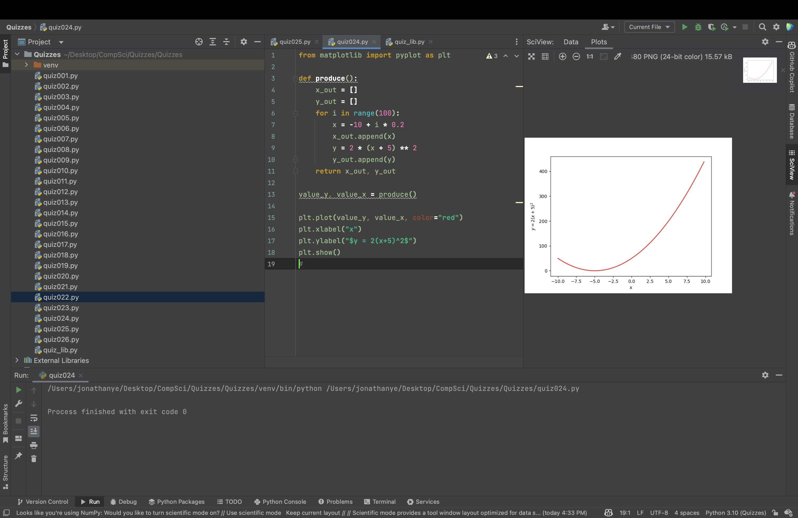

# Quiz 024
Create a program that shows the graph of the parabola $y=2(x+5)^2$ for 100 values of x in the interval of -10 to 10.

```.py
from matplotlib import pyplot as plt

def produce():
    x_out = []
    y_out = []
    for i in range(100):
        x = -10 + i * 0.2
        x_out.append(x)
        y = 2 * (x + 5) ** 2
        y_out.append(y)
    return x_out, y_out

value_y, value_x = produce()

plt.plot(value_y, value_x, color="red")
plt.xlabel("x")
plt.ylabel("$y = 2(x+5)^2$")
plt.show()
```


