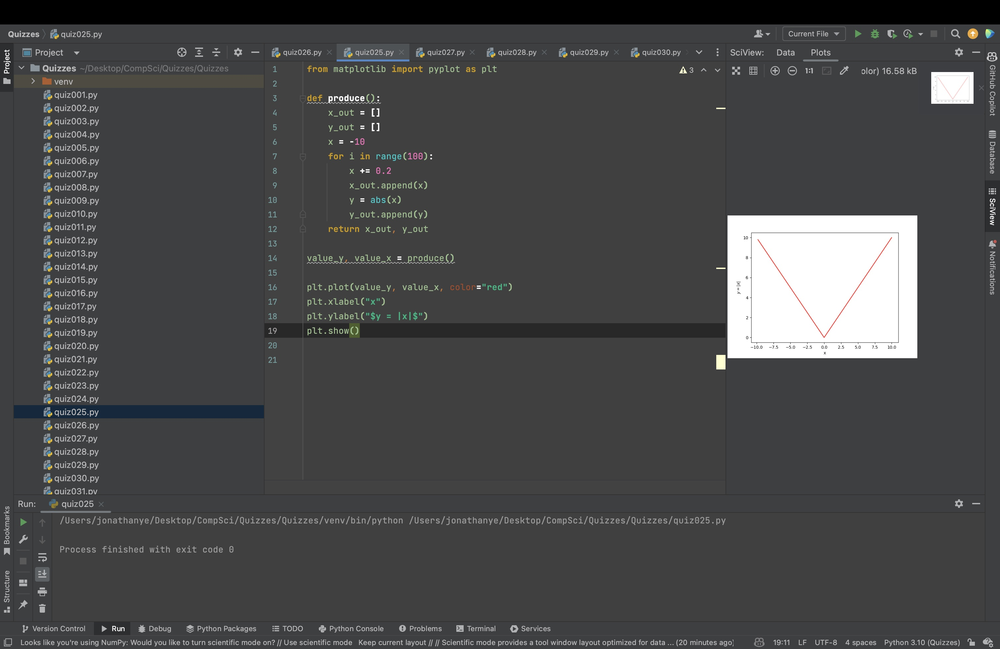

# Quiz 025

Create a program shows the graph of the function below for 100 values of x in the interval -10 < x < 10

```.py
from matplotlib import pyplot as plt

def produce():
    x_out = []
    y_out = []
    x = -10
    for i in range(100):
        x += 0.2
        x_out.append(x)
        y = abs(x)
        y_out.append(y)
    return x_out, y_out

value_y, value_x = produce()

plt.plot(value_y, value_x, color="red")
plt.xlabel("x")
plt.ylabel("$y = |x|$")
plt.show()
```


## Part B

Convert to decimal: FFA5

$(15x15^3)+(15x15^2)+(15x10^1)+(15x5^0)=65445$


