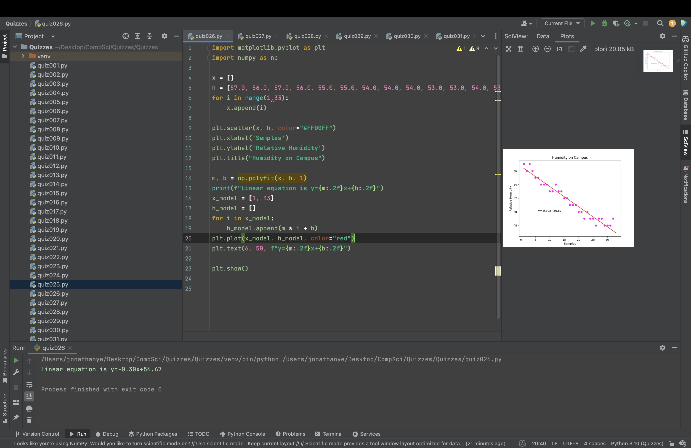

# Quiz 026

Create a program that ① show the graph and ②create a linear (H_model = m*h+b) for the data below:

h = [57.0, 56.0, 57.0, 56.0, 55.0, 55.0, 54.0, 54.0, 54.0, 53.0, 53.0, 54.0, 53.0, 53.0, 52.0, 52.0, 51.0, 51.0, 51.0, 50.0, 50.0, 49.0, 50.0, 49.0, 49.0, 48.0, 49.0, 49.0, 48.0, 48.0, 48.0, 49.0]   ＃32values

Where h is relative humidity (%)

```.py
import matplotlib.pyplot as plt
import numpy as np

x = []
h = [57.0, 56.0, 57.0, 56.0, 55.0, 55.0, 54.0, 54.0, 54.0, 53.0, 53.0, 54.0, 53.0, 53.0, 52.0, 52.0, 51.0, 51.0, 51.0, 50.0, 50.0, 49.0, 50.0, 49.0, 49.0, 48.0, 49.0, 49.0, 48.0, 48.0, 48.0, 49.0]
for i in range(1,33):
    x.append(i)

plt.scatter(x, h, color="#FF00FF")
plt.xlabel('Samples')
plt.ylabel('Relative Humidity')
plt.title("Humidity on Campus")

m, b = np.polyfit(x, h, 1)
print(f"Linear equation is y={m:.2f}x+{b:.2f}")
x_model = [1, 33]
h_model = []
for i in x_model:
    h_model.append(m * i + b)
plt.plot(x_model, h_model, color="red")
plt.text(6, 50, f"y={m:.2f}x+{b:.2f}")

plt.show()
```



## Part B

Convert the following color in hex to rgb: #e6e627
R:230 G:230 B:39
