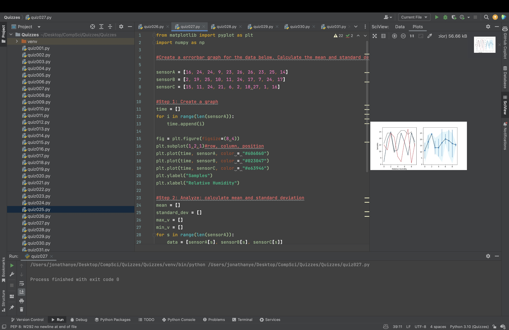

# Quiz 027
Create a errorbar graph for the data below. You will need to calculate the mean and standard deviation first.

sensorA = [16, 24, 24, 9, 23, 26, 26, 23, 25, 14]  
sensorB = [2, 19, 25, 10, 11, 24, 17, 7, 24, 17]  
sensorC = [15, 11, 24, 21, 6, 2, 18, 27, 1, 16]  


```.py
from matplotlib import pyplot as plt
import numpy as np

#Create a errorbar graph for the data below. Calculate the mean and standard deviation first.

sensorA = [16, 24, 24, 9, 23, 26, 26, 23, 25, 14]
sensorB = [2, 19, 25, 10, 11, 24, 17, 7, 24, 17]
sensorC = [15, 11, 24, 21, 6, 2, 18,27, 1, 16]

#Step 1: Create a graph
time = []
for i in range(len(sensorA)):
    time.append(i)

fig = plt.figure(figsize=(8,4))
plt.subplot(1,2,1)#row, column, position
plt.plot(time, sensorA, color = "#606060")
plt.plot(time, sensorB, color = "#023047")
plt.plot(time, sensorC, color = "#e63946")
plt.ylabel("Samples")
plt.xlabel("Relative Humidity")

#Step 2: Analyze: calculate mean and standard deviation
mean = []
standard_dev = []
max_v = []
min_v = []
for s in range(len(sensorA)):
    data = [sensorA[s], sensorB[s], sensorC[s]]
    mean.append(np.mean(data))
    standard_dev.append(np.std(data))
    min_v.append(min(data))
    max_v.append(max(data))

plt.subplot(1,2,2)
plt.plot(time, mean, color = "#003049")
plt.fill_between(time, max_v, min_v, alpha=0.5, color="#caf0f8")
plt.errorbar(time,mean,standard_dev, fmt="o", color="#0077bb")
plt.show()
```



