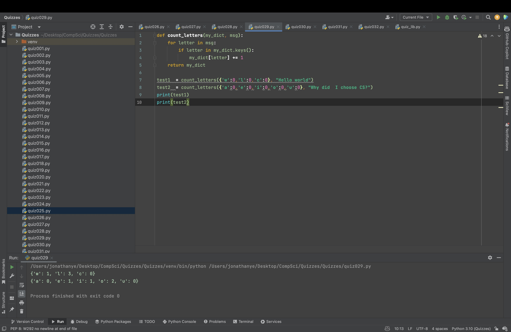

# Quiz 029

Create a function that receives a dictionary with letters in the alphabet as keys and a string. The functions returns the dictionary with a count as value for the occurrence of each letter:

```.py
def count_letters(my_dict, msg):
    for letter in msg:
        if letter in my_dict.keys():
            my_dict[letter] += 1
    return my_dict

test1  = count_letters({'w':0,'l':0,'c':0}, "Hello world")
test2  = count_letters({'a':0,'e':0,'i':0,'o':0,'u':0}, "Why did  I choose CS?")
print(test1)
print(test2)
```


