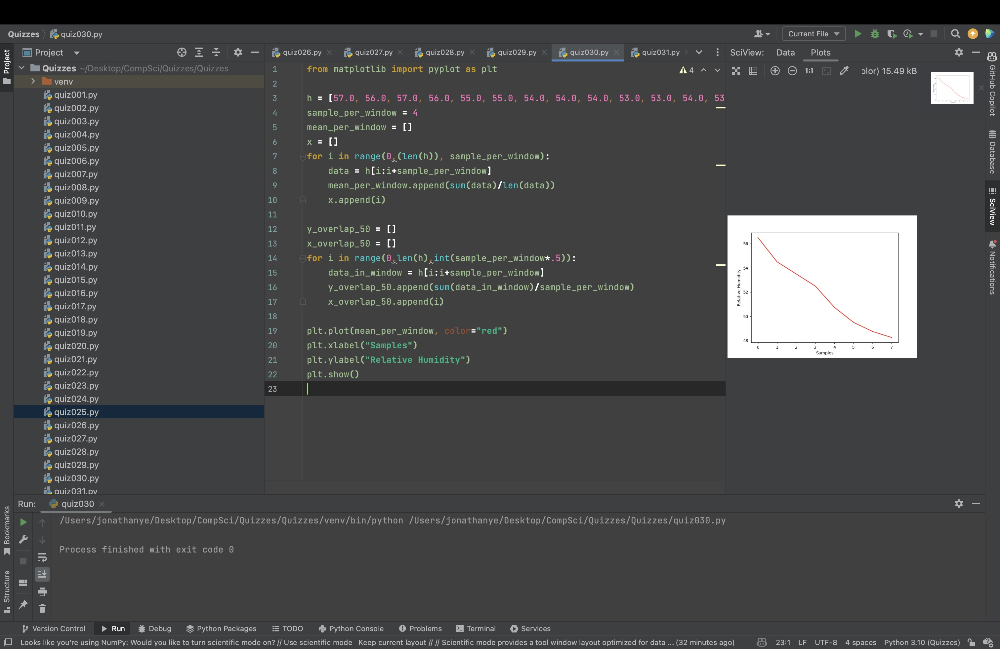

# Quiz 030
Using the data in the learning Log (Item 21), create a graph with a smoothed version where the smoothing window is every 4 points.


```.py
from matplotlib import pyplot as plt

h = [57.0, 56.0, 57.0, 56.0, 55.0, 55.0, 54.0, 54.0, 54.0, 53.0, 53.0, 54.0, 53.0, 53.0, 52.0, 52.0, 51.0, 51.0, 51.0, 50.0, 50.0, 49.0, 50.0, 49.0, 49.0, 48.0, 49.0, 49.0, 48.0, 48.0, 48.0, 49.0]
sample_per_window = 4
mean_per_window = []
x = []
for i in range(0,(len(h)), sample_per_window):
    data = h[i:i+sample_per_window]
    mean_per_window.append(sum(data)/len(data))
    x.append(i)

y_overlap_50 = []
x_overlap_50 = []
for i in range(0,len(h),int(sample_per_window*.5)):
    data_in_window = h[i:i+sample_per_window]
    y_overlap_50.append(sum(data_in_window)/sample_per_window)
    x_overlap_50.append(i)

plt.plot(mean_per_window, color="red")
plt.xlabel("Samples")
plt.ylabel("Relative Humidity")
plt.show()
```



## Part B
### When was the internet first created?
January 1, 1983 is considered the official birthday of the Internet.

Citation: https://www.usg.edu/galileo/skills/unit07/internet07_02.phtml#:~:text=January%201%2C%201983%20is%20considered,Protocol%20(TCP%2FIP).


