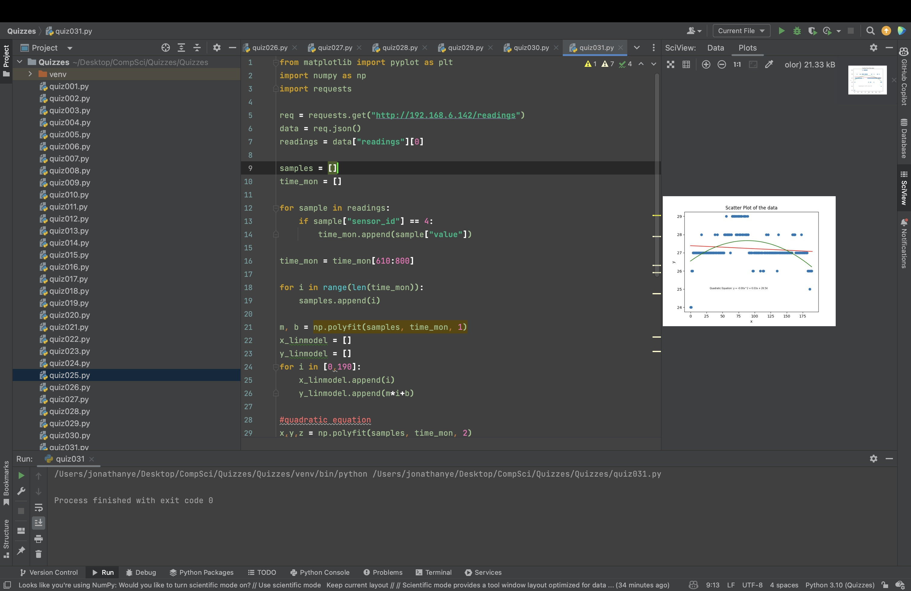

# Quiz 031
Connect to the server and download the recordings data. From the data, build a linear model between t=610 and t=800 

```.py
from matplotlib import pyplot as plt
import numpy as np
import requests

req = requests.get("http://192.168.6.142/readings")
data = req.json()
readings = data["readings"][0]

samples = []
time_mon = []

for sample in readings:
    if sample["sensor_id"] == 4:
        time_mon.append(sample["value"])

time_mon = time_mon[610:800]

for i in range(len(time_mon)):
    samples.append(i)

m, b = np.polyfit(samples, time_mon, 1)
x_linmodel = []
y_linmodel = []
for i in [0,190]:
    x_linmodel.append(i)
    y_linmodel.append(m*i+b)

#quadratic equation
x,y,z = np.polyfit(samples, time_mon, 2)
x_quadmodel = []
y_quadmodel = []
for i in range(0,190):
    x_quadmodel.append(i)
    y_quadmodel.append(x*i**2+y*i+z)


plt.scatter(samples, time_mon)
plt.plot(x_linmodel,y_linmodel, color="red")
plt.text(70, 20, f"Linear Equation: y = {m:.2f}x + {b:.2f}", fontsize=6)
plt.plot(x_quadmodel,y_quadmodel, color="green")
plt.text(30, 25, f"Quadratic Equation: y = {x:.2f}x^2 + {y:.2f}x + {z:.2f}", fontsize=6)
plt.title("Scatter Plot of the data")
plt.xlabel("x")
plt.ylabel("y")
plt.show()
```


