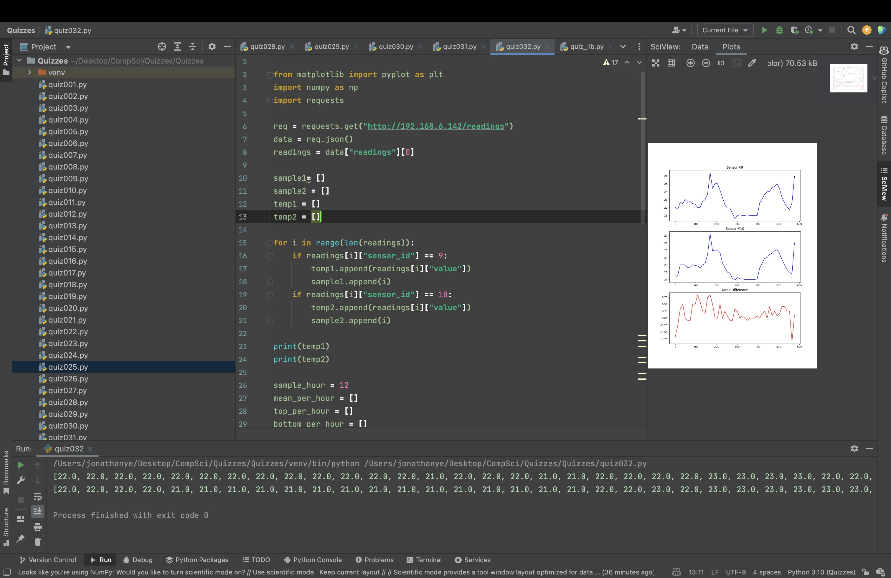

# Quiz 032
Compare the data from sensor#9 and 10 with smoothing of 12 samples.


```.py

from matplotlib import pyplot as plt
import numpy as np
import requests

req = requests.get("http://192.168.6.142/readings")
data = req.json()
readings = data["readings"][0]

sample1= []
sample2 = []
temp1 = []
temp2 = []

for i in range(len(readings)):
    if readings[i]["sensor_id"] == 9:
        temp1.append(readings[i]["value"])
        sample1.append(i)
    if readings[i]["sensor_id"] == 10:
        temp2.append(readings[i]["value"])
        sample2.append(i)

print(temp1)
print(temp2)

sample_hour = 12
mean_per_hour = []
top_per_hour = []
bottom_per_hour = []
x = []
mean_per_hour2 = []
top_per_hour2 = []
bottom_per_hour2 = []
x2 = []

for i in range(0, len(temp1), sample_hour):
    mean_per_hour.append(np.mean(temp1[i:i + sample_hour]))
    x.append(i)

for i in range(0, len(temp2), sample_hour):
    mean_per_hour2.append(np.mean(temp2[i:i + sample_hour]))
    x2.append(i)

difference = []
if len(mean_per_hour) == len(mean_per_hour2):
    for i in range(len(mean_per_hour)):
        difference.append(mean_per_hour2[i] - mean_per_hour[i])


fig = plt.figure(figsize=(9,12))
plt.subplot(3,1,1)
plt.plot(x,mean_per_hour, color = "blue")
plt.title("Sensor #9")
plt.subplot(3,1,2)
plt.plot(x2,mean_per_hour2, color = "blue")
plt.title("Sensor #10")
plt.subplot(3,1,3)
plt.plot(x,difference, color = "red")
plt.title("Mean Difference")
plt.show()
```


