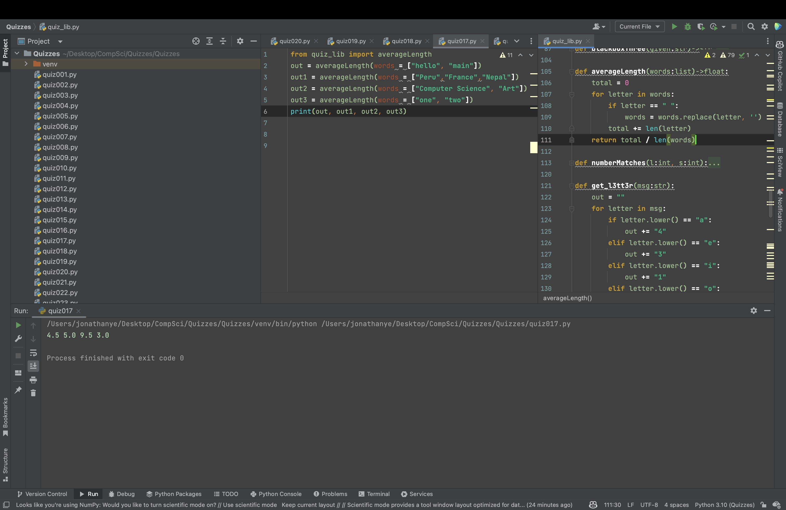

# Quiz 017

Create a function that produces the average world length of the input list.


```.py
def averageLength(words:list)->float:
    total = 0
    for letter in words:
        if letter == " ":
            words = words.replace(letter, '')
        total += len(letter)
    return total / len(words)
```


