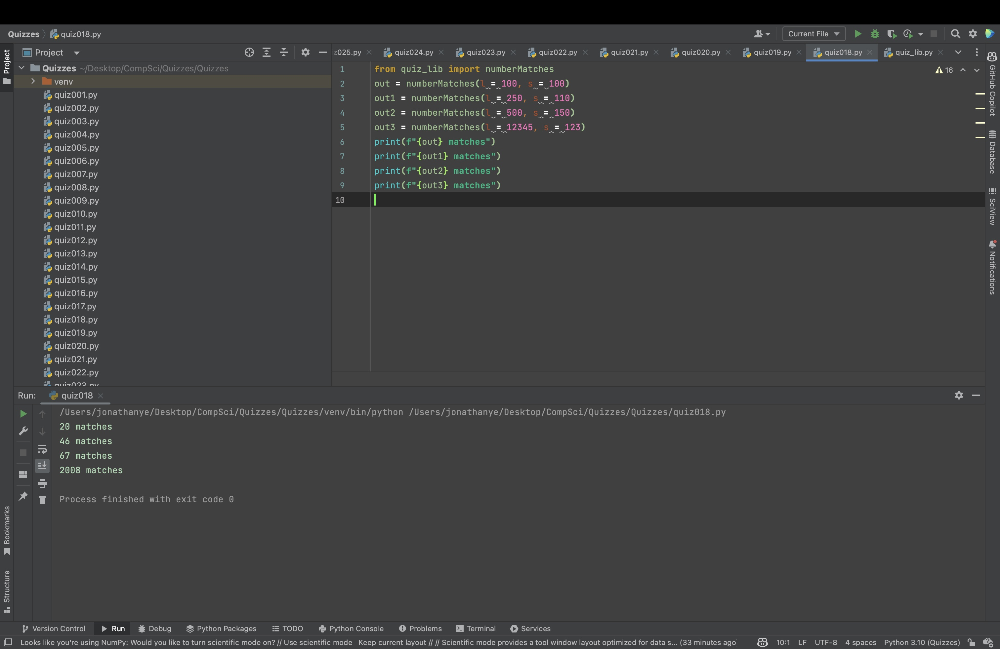
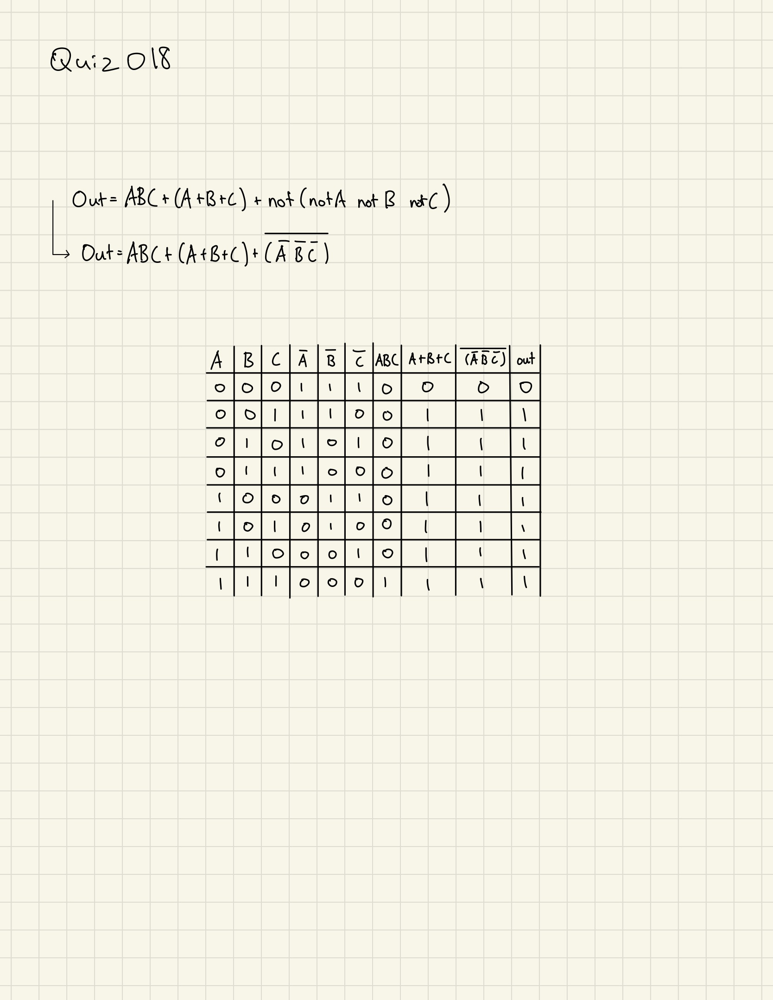

# Quiz 018

```.py
def numberMatches(l:int, s:int):
    l = l * 100
    if ((l / s) % 5) == 0:
        out = int((l / s) / 5)
    else:
        out = int(((l / s) // 5) + 1)
    return out
```



## Flow Chart


