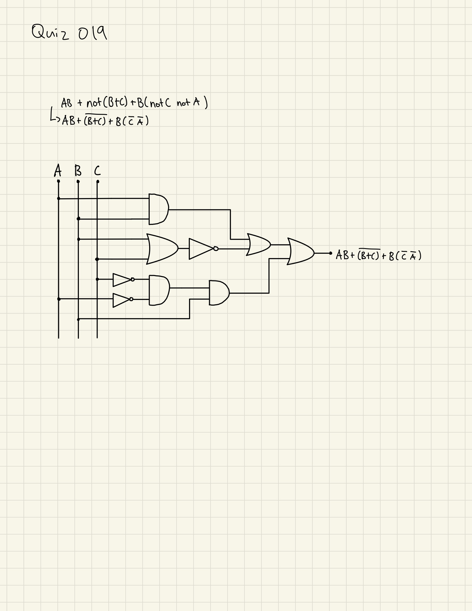

# Quiz 019
Create a function that changes the vowels in a string to numbers such as a=4,e=3,i=1,o=0 and space by _


```.py
def get_l3tt3r(msg:str):
    out = ""
    for letter in msg:
        if letter.lower() == "a":
            out += "4"
        elif letter.lower() == "e":
            out += "3"
        elif letter.lower() == "i":
            out += "1"
        elif letter.lower() == "o":
            out += "0"
        elif letter.lower() == " ":
            out += "_"
        else:
            out += letter
    return out
```


## Boolean Circuit




